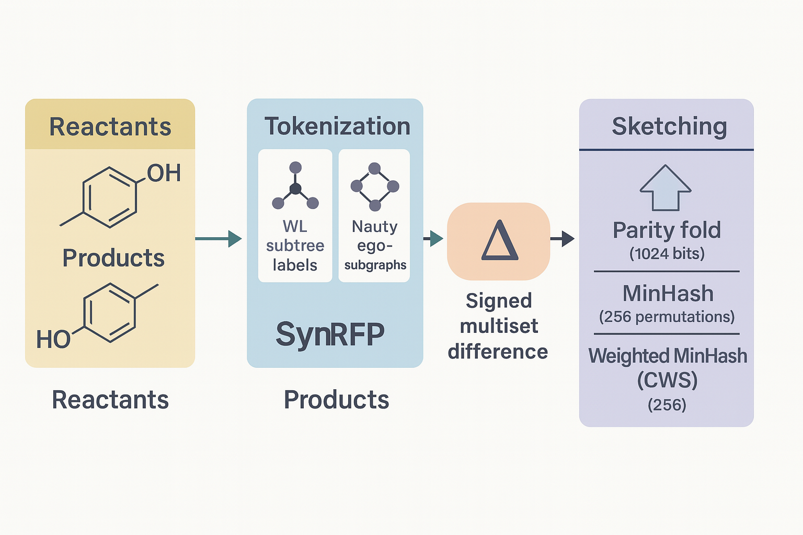

# SynRFP

**SynRFP** (Synthesis Reaction FingerPrint) is a mapping-free, graph-invariant fingerprinting framework for chemical reactions. It represents transformations by:

1. **Extracting local graph tokens**  
   - Weisfeiler–Lehman (WL) subtree hashes  
   - Canonical ego-subgraph hashes (via `pynauty`)

2. **Computing a signed multiset difference**  
   - Δ = tokens(product) − tokens(reactant)

3. **Compressing into compact sketches**  
   - **ParityFold**: binary parity-fold into _B_ bits  
   - **MinHashSketch**: classical MinHash with _m_ permutations  
   - **CWSketch**: weighted MinHash for signed deltas  

This approach requires **no atom-mapping** or reactant/reagent distinction, is **permutation-invariant**, and **scales linearly** with graph size.



---

## 📁 Repository Structure
```bash
synrfp/
├── __init__.py           # package exports & version
├── synrfp.py             # core driver: convenience builders & similarity functions, rsmi_to_fingerprint
├── encoder.py            # SynRFPEncoder: batch‐encode RSMI list → 2D bit arrays
├── graph/
│   ├── __init__.py
│   ├── graph_data.py     # GraphData container & utilities
│   └── reaction.py       # Reaction.from_rsmi / from_graph, Reaction collection API
├── tokenizers/
│   ├── __init__.py
│   ├── base.py           # BaseTokenizer interface
│   ├── utils.py          # _h64, atom_label_tuple, bond_label_tuple helpers
│   ├── wl.py             # WLTokenizer implementation
│   └── nauty.py          # NautyTokenizer implementation
└── sketchers/
    ├── __init__.py
    ├── base.py           # BaseSketch & WeightedSketch interfaces
    ├── parity_fold.py    # ParityFold sketcher
    ├── minhash_sketch.py # MinHashSketch sketcher
    └── cw_sketch.py      # CWSketch sketcher
```
## ⚙️ Installation

```bash
# 1) Clone the repository
git clone https://github.com/TieuLongPhan/synrfp.git
cd synrfp

# 2) Install the package (with optional extras)
pip install .                  # core functionality
pip install .[all]             # with datasketch and pynauty support
```
or can install via pip
```bash
pip install synrfp
```

## 🔧 Quick Start

### 1. Single‐reaction fingerprint

```python
from synrfp.graph.reaction import Reaction
from synrfp import SynRFP
from synrfp.tokenizers.wl import WLTokenizer
from synrfp.sketchers.parity_fold import ParityFold

# Parse RSMI into GraphData
reactant_G, product_G = Reaction.from_rsmi("CCO>>C=C.O")

# Build engine: WL at radius 1 + 1024-bit parity-fold
fp_engine = SynRFP(
    tokenizer=WLTokenizer(),
    radius=1,
    sketch=ParityFold(bits=1024, seed=42),
)

# Compute fingerprint
res = fp_engine.fingerprint(reactant_G, product_G)
print(res)               # SynRFPResult(tokens_R=3 tokens, tokens_P=3 tokens, support=0, sketch_type=bytearray)
bits = res.to_binary()   # [0,1,0,0, …]
```

### 2. One‐line wrapper

```python
from synrfp import synrfp

# Generate a 1024-bit binary fingerprint in one call
bits = synrfp(
    "CCO>>C=C.O",
    tokenizer="wl",
    radius=1,
    sketch="parity",
    bits=1024,
    seed=42,
)
print(len(bits), bits[:16])  # e.g. 1024 [0, 1, 0, 0, …]
```

### 3.  Batch encoding

```python
from synrfp import BatchEncoder

rxn_smiles = [
    "CO.O[C@@H]1CCNC1.[C-]#[N+]CC(=O)OC>>[C-]#[N+]CC(=O)N1CC[C@@H](O)C1",
    "CCOC(=O)C(CC)c1cccnc1.Cl.O>>CCC(C(=O)O)c1cccnc1",
]

# Encode two reactions into a 2×1024 array of bits
fps = BatchEncoder.encode(
    rxn_smiles,
    tokenizer="wl",
    radius=1,
    sketch="parity",
    bits=1024,
    seed=42,
    batch_size=2
)

print(fps.shape)    # (2, 1024)
print(fps[0][:16])  # first 16 bits of the first fingerprint
```

## Contributing
- [Tieu-Long Phan](https://tieulongphan.github.io/)

## License

This project is licensed under MIT License - see the [License](LICENSE) file for details.

## Acknowledgments

This project has received funding from the European Unions Horizon Europe Doctoral Network programme under the Marie-Skłodowska-Curie grant agreement No 101072930 ([TACsy](https://tacsy.eu/) -- Training Alliance for Computational)