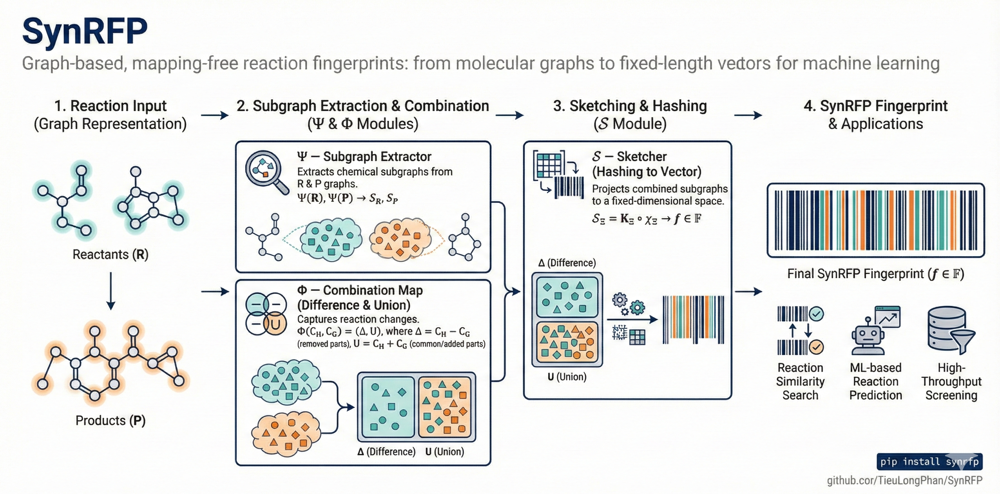

.. _getting_started:

.. container:: badges

   .. image:: https://img.shields.io/pypi/v/synrfp.svg
      :alt: PyPI version
      :target: https://pypi.org/project/synrfp/
      :align: left

   .. image:: https://zenodo.org/badge/1032455620.svg
      :alt: Zenodo DOI
      :target: https://doi.org/10.5281/zenodo.17563778
      
   .. image:: https://github.com/TieuLongPhan/synrfp/actions/workflows/publish-package.yml/badge.svg
      :alt: CI status
      :target: https://github.com/TieuLongPhan/synrfp/actions/workflows/publish-package.yml
      :align: left

   .. raw:: html

      

===============================
Getting Started with SynRFP
===============================

Welcome to the **SynRFP** documentation.

**SynRFP** is a mapping-free, graph-based toolkit for converting chemical
transformations (reaction SMILES) into compact, reproducible fingerprints.
It separates the pipeline into three modular operators: tokenizers (graph → tokens),
combination/Δ aggregation, and randomized sketchers (multiset → fixed-size sketch).
The high-level convenience wrapper and engine are implemented in the `synrfp` module. :contentReference[oaicite:0]{index=0}

.. _fig:synrfp-workflow:

   Figure 1 — Overview of the SynRFP pipeline.

Installation
------------

Python requirements
~~~~~~~~~~~~~~~~~~~
SynRFP targets **Python 3.11 or later**.

Create an isolated environment (recommended)
~~~~~~~~~~~~~~~~~~~~~~~~~~~~~~~~~~~~~~~~~~~~

.. code-block:: bash

   # venv
   python -m venv .venv
   source .venv/bin/activate

   # or conda
   conda create --name synrfp-env python=3.11
   conda activate synrfp-env

Install from PyPI
~~~~~~~~~~~~~~~~~
Install the stable release:

.. code-block:: bash

   pip install synrfp

Install the package for development
~~~~~~~~~~~~~~~~~~~~~~~~~~~~~~~~~~~

.. code-block:: bash

   git clone https://github.com/TieuLongPhan/SynRFP.git
   cd SynRFP
   python -m venv .venv
   source .venv/bin/activate
   pip install -e ".[dev]"

This installs SynRFP in editable mode so local edits are immediately importable.

Quick sanity checks
------------------

Check the installed version
~~~~~~~~~~~~~~~~~~~~~~~~~~~

.. code-block:: bash

   python -c "import importlib.metadata as m; print(m.version('synrfp'))"

Core concepts & where to find them
~~~~~~~~~~~~~~~~~~~~~~~~~~~~~~~~~
- The convenience wrapper `synrfp(...)` converts an RSMI string to a binary bit vector; see the top-level implementation. :contentReference[oaicite:1]{index=1}  
- The `SynRFP` engine composes a tokenizer with either an unweighted sketcher (e.g., `ParityFold`, `MinHashSketch`) or a weighted sketcher (e.g., `CWSketch`). See the ParityFold and sketcher implementations.   
- Reactions are parsed into lightweight `GraphData` containers and `Reaction` objects; these helpers are used by `SynRFP` for robust graph construction. 

Minimal examples
~~~~~~~~~~~~~~~~

1) Verify a single reaction fingerprint (one-liner)

.. code-block:: python

   from synrfp.synrfp import synrfp

   bits = synrfp(
       "CCO>>C=C.O",
       tokenizer="wl",     # "wl" or "nauty"
       radius=1,
       sketch="parity",    # "parity", "minhash", or "cw"
       bits=1024,
       seed=42,
   )
   print(len(bits), bits[:16])  # -> 1024, [0,1,0,0,...]  (binary vector)
   # synrfp(...) convenience wrapper implemented in synrfp.py. 

2) Build an engine programmatically (tokenizer + sketcher)

.. code-block:: python

   from synrfp.tokenizers.wl import WLTokenizer
   from synrfp.sketchers.parity_fold import ParityFold
   from synrfp.synrfp import SynRFP, build_graph_from_printout, tanimoto_bits

   # Tokenizer and sketcher classes (examples)
   tok = WLTokenizer()
   sk = ParityFold(bits=1024, seed=0)

   # Create a SynRFP engine
   fp_engine = SynRFP(tokenizer=tok, radius=1, sketch=sk)
   # fp_engine.fingerprint(...) expects GraphData instances. GraphData helpers live in graph_data.py. 

3) Encode a batch of reactions (parallel-friendly)

.. code-block:: python

   from synrfp.encoder import SynRFPEncoder

   rxn_smiles = ["CCO>>C=C.O", "CO>>CO2"]
   fps = SynRFPEncoder.encode(
       rxn_smiles,
       tokenizer="wl",
       radius=1,
       sketch="parity",
       bits=1024,
       seed=0,
   )
   print(fps.shape)  # (2, 1024)  

For more extensive examples and tutorials, visit the
:ref:`tutorials-and-examples` section.